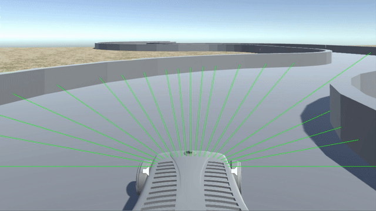

# SensorCar

Software for a self-driving car, based on artificial neural networks (ANNs). An Unity simulation is provided to run the car.



Multiple sensors provide distance information to the ANN. In the evaluation process, these data is used to get the steering angle.

A module is provided for generating an infinitely long, randomly generated road. The SensorCar is capable of driving through this road map without any collisions.

:exclamation: This project started as a proof of principle and contains two different networks. One is programmed without the use of any high-level libraries whereas the other is build with Tensorflow.

## Getting Started

These instructions will get you a copy of the project up and running on your local machine.

### Prerequisites

This project requires Unity3D and Python +3.6.

### Installing

* Download a copy of this project.

* Install the required Python packages with `pip`:

```
pip install -r requirements.txt
```

## Run the Car on the ANN
* Load TF Network and start socket server
```
python3 mainCli.py --drive ./examples/21-100-50-20-1-0_001-21SensorsTF/model
```

* Open the scene `infinityRoad21` from `./simulation/sensorCar/Assets/Scenes/` with Unity and start it by pressing on the play button.

## Generate a Training Dataset

* Load the scene `infinityRoad{3|21}` from `./simulation/sensorCar/Assets/Scenes/` with Unity.

* Start the scene and manoeuvre the car with the <kbd>←</kbd> , <kbd>↑</kbd> , <kbd>→</kbd> , <kbd>↓</kbd> keys.

* Press <kbd>r</kbd> to start the recording and then <kbd>f</kbd> to stop it again.

## Train The Neural Network
* Train a TF network
```
python3 mainCli.py --train ./examples/dataset21Sensors/ds21.txt \
--shape 21 100 50 20 1 --learningrate 0.001 --epochs 1000 --saveinterval 10
```

## License

This project is licensed under the MIT License - see the [LICENSE.md](LICENSE.md) file for details

